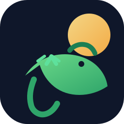

# 🤖 Iguana  — CRM-система поддержки через Telegram и VK



## 🧩 Описание

**Iguana** — CRM-система поддержки, которая позволяет:
- ✅ Принимать заявки через Telegram и VK ботов
- ✅ Обрабатывать обращения через веб-панель (Spring Boot)
- ✅ Вести историю переписки, закрывать заявки и собирать оценки
- ✅ Анализировать статистику по бизнесу, городам и категориям

---

## 🚀 Возможности

### 🤖 Боты
- ✅ Приём заявок из Telegram и VK
- ✅ Поддержка фото, голосовых, видео и документов
- ✅ Автоматическое создание заявок и сохранение истории сообщений
- ✅ Поддержка каналов/ботов с отдельными базами данных

### 🌐 Веб-панель (Spring)
- ✅ Список всех заявок и фильтрация по ключевым полям
- ✅ Ответы через Telegram/VK API
- ✅ История переписки по каждой заявке
- ✅ Аналитика и отчёты
- ✅ Управление запуском ботов прямо из панели настроек

---
## 🪟 Запуск на Windows

Spring-версия панели совместима с Windows 10/11. Подробный гайд расположен в [`docs/windows_setup.md`](docs/windows_setup.md). Вкратце:

- установите JDK 17 (Maven будет загружен автоматически при первом запуске `mvnw`);
- перейдите в `spring-panel` и выполните `\run-windows.bat` в PowerShell или `cmd.exe`;
- дополнительные параметры передавайте через `JAVA_OPTS` (для JVM) и `SPRING_OPTS` (для аргументов приложения).:

По умолчанию приложение стартует на <http://localhost:8080/> с логином `admin` / `admin`.

## 🐧 Запуск на Linux

Для Linux доступен аналогичный скрипт `run-linux.sh`:

```bash
cd spring-panel
export JAVA_OPTS="-Xmx1024m"
export SPRING_OPTS="--server.port=8080"
./run-linux.sh
```

---

## ⚙️ Конфигурация

Панель и бот используют переменные окружения и общие JSON-файлы из `config/shared`.

1. Создайте `.env` с ключевыми параметрами (`TELEGRAM_BOT_TOKEN`, `APP_DB_*`, `APP_BOT_DATABASE_DIR`).
2. Отредактируйте `config/shared/settings.json`, `locations.json`, `org_structure.json` при необходимости.
3. При старте сервисы создают недостающие SQLite-файлы автоматически.

### 🗃️ Разделение баз данных

Проект использует отдельные SQLite-файлы:

- `tickets.db` — заявки и сообщения;
- `users.db` — пользователи панели;
- `clients.db` — клиентские профили;
- `knowledge_base.db` — база знаний;
- `objects.db` — база объектов;
- `settings.db` — общие настройки и связи между базами;
- `bot-<channelId>.db` — отдельные базы для каждого бота (каталог задаётся через `APP_BOT_DATABASE_DIR`).

Панель создаёт таблицы и регистрирует связи между базами автоматически при запуске.

---

## 🔧 Запуск ботов из панели

Откройте «Настройки → Каналы (боты)», выберите нужный канал и нажмите **«Запустить бота»**. Панель:

- создаст отдельную базу данных для канала;
- запустит Java-бот в отдельном процессе;
- отобразит статус запуска прямо в окне настройки канала.

---

## 📚 Документация

- [docs/configuration.md](docs/configuration.md) — конфигурация через переменные окружения.
- [docs/database-paths.md](docs/database-paths.md) — пути к SQLite-файлам и их назначение.
- [docs/environment_variables.md](docs/environment_variables.md) — полный список переменных.
- [docs/java_bot.md](docs/java_bot.md) — сборка и запуск Java-ботов (Maven Wrapper).
- [docs/vk_bot_setup.md](docs/vk_bot_setup.md) — настройка VK-бота.
- [docs/ui_ux_audit.md](docs/ui_ux_audit.md) — UI/UX аудит с внедрёнными правками и roadmap развития панели.
