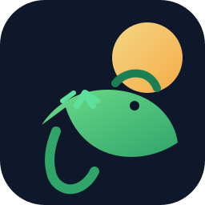

# Iguana



Iguana - многоканальная support CRM и операторская панель для обработки обращений из `Telegram`, `VK` и `MAX`.
Проект объединяет приём сообщений, очередь диалогов, карточки клиентов, базу знаний, аналитику, управление ботами и служебные сценарии сопровождения в одном контуре.

Этот репозиторий ориентирован в первую очередь на Windows-эксплуатацию, но содержит и Linux-скрипты запуска. Основной UI и orchestration живут в `spring-panel`, а транспортные боты и shared runtime - в `java-bot`.

## Актуальная документация

Если нужен один главный документ по текущему состоянию проекта на `25 августа 2026 года`, начинайте с [docs/CURRENT_PROJECT_DOCUMENTATION.md](docs/CURRENT_PROJECT_DOCUMENTATION.md).

В нём собраны:

- актуальная архитектура `spring-panel` и `java-bot`;
- текущие правила UI и client-side runtime;
- ownership данных, storage и infrastructure contour;
- карта модулей, потоков данных и практические правила развития проекта.

## Что есть в системе

- операторская панель с очередью обращений, историей сообщений, назначением ответственных и SLA;
- каналы `Telegram`, `VK`, `MAX` с отдельными runtime-процессами ботов;
- шаблоны вопросов, сценарии оценок, авто-действия и аналитические разрезы по обращениям;
- карточки клиентов, канальные идентификаторы, вложения и история обращений;
- база знаний и сопутствующий knowledge workflow;
- dashboard и operational analytics по каналам, бизнесам, локациям, сотрудникам и продуктовым направлениям;
- контур мониторинга и служебные настройки проекта;
- shared JSON-справочники в `config/shared/`.

## Архитектурная схема

### `spring-panel/`

Spring Boot приложение с серверным UI и backend-логикой:

- страница диалогов;
- dashboard;
- настройки каналов, ботов, шаблонов, ролей и оргструктуры;
- база знаний;
- управление запуском bot runtime;
- серверные API для operator workflow и внутренних runtime-сценариев.

### `java-bot/`

Maven multi-module проект с ботами и общим ядром:

- `bot-core` - общая бизнес-логика, runtime-сервисы, question flow, ticket lifecycle;
- `bot-telegram` - Telegram runtime;
- `bot-vk` - VK runtime;
- `bot-max` - MAX runtime.

### `config/shared/`

Общие JSON-конфиги, которые используются приложением и ботами:

- `settings.json` - прикладные настройки и справочники;
- `locations.json` - локации и связанные данные;
- `org_structure.json` - оргструктура и отделы;
- `monitoring-credentials.key` - служебный ключ для monitoring-контура.

## Быстрый старт

### Windows

1. Установите `JDK 17`.
2. Перейдите в каталог `spring-panel`.
3. Запустите `.\run-windows.bat`.
4. Дождитесь старта Spring Boot.
5. Откройте панель по адресу `http://localhost:8080/`.

Базовый сценарий:

```powershell
cd spring-panel
.\run-windows.bat
```

На свежем клоне `run-windows.bat` теперь сам запускает first-run bootstrap:

- создаёт корневой `.env`, если его ещё нет;
- подготавливает `attachments/`, `logs/` и `bot_databases/`;
- поднимает локальные `PostgreSQL` и `RabbitMQ`, переводит старт в `APP_DB_MODE=postgresql` и включает `APP_INTEGRATION_TRANSPORT_MODE=rabbitmq`;
- если Docker недоступен, bootstrap теперь завершается ошибкой вместо молчаливого перехода в SQLite;
- дефолтные runtime-конфиги `spring-panel` и `java-bot` теперь тоже ориентированы на `APP_DB_MODE=postgresql`;
- `APP_DB_MODE=sqlite` оставлен только как явный compatibility override для локального legacy/dev-сценария.

Для ручного повторного bootstrap используйте `scripts/bootstrap-first-run.ps1` или `scripts/bootstrap-first-run.sh`.

Если порт `8080` занят, `run-windows.bat` пытается подобрать свободный HTTP-порт автоматически.

Пример запуска с параметрами:

```powershell
$env:JAVA_OPTS='-Xmx1024m'
$env:SPRING_OPTS='--server.port=8080'
.\run-windows.bat
```

### Linux

```bash
cd spring-panel
export JAVA_OPTS="-Xmx1024m"
export SPRING_OPTS="--server.port=8080"
./run-linux.sh
```

## Что нужно для рабочего запуска

Минимальный набор:

1. `JDK 17`.
2. Исходники этого репозитория.
3. Актуальные SQLite-базы и `bot_databases/`.
4. Каталог `attachments/`, если нужны вложения и пользовательские файлы.
5. Корректные токены/секреты окружения для нужных каналов.
6. JSON-конфиги в `config/shared/`.
7. Для PostgreSQL-first transport path с ownership split нужен локальный или внешний `RabbitMQ`.

Maven wrapper уже лежит в репозитории, поэтому отдельная установка Maven обычно не требуется.

## Каталоги, которые важно знать

| Каталог | Назначение |
| --- | --- |
| `spring-panel/` | UI, backend, настройки, dashboard, knowledge base, orchestration |
| `java-bot/` | код и runtime модулей ботов |
| `config/shared/` | shared JSON-конфиги |
| `attachments/` | пользовательские вложения, knowledge assets, аватары и другие файлы |
| `bot_databases/` | legacy per-channel SQLite shard-файлы `bot-<channelId>.db` для import/диагностики |
| `docs/` | эксплуатационная и архитектурная документация |
| `ai-context/` | AI-контекст, правила проекта, task-tracking и changelog |

## Основные базы данных

Канонические SQLite-файлы в текущем контуре:

- `panel_runtime.db` - обращения, сообщения, активный runtime панели;
- `panel_identity.db` - пользователи панели, роли и часть identity-данных;
- `bot_runtime.db` - shared bot runtime;
- `monitoring.db` - monitoring-контур;
- `clients.db` - transitional контур клиентов;
- `knowledge_base.db` - transitional контур базы знаний;
- `objects.db` - transitional контур паспортов объектов;
- per-channel `bot-<channelId>.db` - legacy import-only слой, а не live source of truth.

Подробная карта путей и canonical aliases описана в [docs/database-paths.md](docs/database-paths.md).

## Конфигурация

Проект использует:

- переменные окружения;
- SQLite-файлы по умолчанию;
- JSON-настройки в `config/shared/`;
- UI-настройки через `spring-panel`.

Ключевые переменные:

- `APP_DB_PANEL_RUNTIME`
- `APP_DB_PANEL_IDENTITY`
- `APP_DB_BOT_RUNTIME`
- `APP_DB_MONITORING`
- `APP_DB_CLIENTS`
- `APP_DB_KNOWLEDGE`
- `APP_DB_OBJECTS`
- `APP_BOT_DATABASE_DIR`
- `APP_STORAGE_ATTACHMENTS`
- `TELEGRAM_BOT_TOKEN`
- `VK_BOT_TOKEN`
- `MAX_BOT_TOKEN`

Полный список смотрите в [docs/environment_variables.md](docs/environment_variables.md).

## Как обычно запускается Iguana

1. Поднимается `spring-panel`.
2. Через UI открывается раздел `Настройки -> Каналы (боты)`.
3. Для нужного канала запускается соответствующий bot runtime.
4. Операторы работают с обращениями через страницу диалогов.

То есть панель является центром конфигурации и operational control, а сами боты могут жить отдельными процессами.

## Главные документы

### Старт и эксплуатация

- [docs/IGUANA_PROJECT_GUIDE.md](docs/IGUANA_PROJECT_GUIDE.md)
- [docs/IGUANA_DATA_LIFECYCLE_AND_STORAGE_STRATEGY.md](docs/IGUANA_DATA_LIFECYCLE_AND_STORAGE_STRATEGY.md)
- [docs/IGUANA_TRANSFER_WINDOWS.md](docs/IGUANA_TRANSFER_WINDOWS.md)
- [docs/windows_setup.md](docs/windows_setup.md)
- [docs/configuration.md](docs/configuration.md)
- [docs/environment_variables.md](docs/environment_variables.md)
- [docs/database-paths.md](docs/database-paths.md)
- [docs/database_distribution.md](docs/database_distribution.md)

Для быстрой инвентаризации storage/growth используйте `python scripts/report-iguana-storage.py` или откройте в админке `Настройки -> Storage inventory Iguana`.

### Боты и каналы

- [docs/java_bot.md](docs/java_bot.md)
- [docs/vk_bot_setup.md](docs/vk_bot_setup.md)
- [docs/max_bot_setup.md](docs/max_bot_setup.md)
- [docs/BOT_RUNTIME_CONTRACT.md](docs/BOT_RUNTIME_CONTRACT.md)
- [docs/conversation_flow.md](docs/conversation_flow.md)

### Архитектура и развитие

- [docs/CURRENT_PROJECT_DOCUMENTATION.md](docs/CURRENT_PROJECT_DOCUMENTATION.md)
- [docs/OOP_ARCHITECTURE_OVERVIEW.md](docs/OOP_ARCHITECTURE_OVERVIEW.md)
- [docs/ARCHITECTURE_AUDIT_2026-04-08.md](docs/ARCHITECTURE_AUDIT_2026-04-08.md)
- [docs/ARCH_UI_REFACTORING_ROADMAP_2026-04-15.md](docs/ARCH_UI_REFACTORING_ROADMAP_2026-04-15.md)
- [docs/REFACTORING_PLAN_2026.md](docs/REFACTORING_PLAN_2026.md)
- [docs/SQLITE_BOOTSTRAP_PERIMETER.md](docs/SQLITE_BOOTSTRAP_PERIMETER.md)
- [docs/POSTGRESQL_FIRST_READINESS_CLOSEOUT.md](docs/POSTGRESQL_FIRST_READINESS_CLOSEOUT.md)

## Перенос на другую машину

Для переноса и запуска на другом Windows-хосте используйте:

- [docs/IGUANA_TRANSFER_WINDOWS.md](docs/IGUANA_TRANSFER_WINDOWS.md) - полная инструкция;
- [scripts/export-iguana-portable.ps1](scripts/export-iguana-portable.ps1) - воспроизводимая сборка переносимого пакета.

По умолчанию экспорт формируется в `C:\Intel\iguana`.

## Если нужно быстро разобраться в проекте

Рекомендуемый порядок чтения:

1. `README.md`
2. [docs/IGUANA_PROJECT_GUIDE.md](docs/IGUANA_PROJECT_GUIDE.md)
3. [docs/IGUANA_TRANSFER_WINDOWS.md](docs/IGUANA_TRANSFER_WINDOWS.md)
4. [docs/environment_variables.md](docs/environment_variables.md)
5. [docs/database-paths.md](docs/database-paths.md)
6. [docs/java_bot.md](docs/java_bot.md)

## Практический смысл этого репозитория

Iguana - не просто кодовая база, а рабочий support-контур с состоянием, ботами, SQLite-хранилищами, вложениями и служебными настройками. Поэтому для корректного переноса важно относиться к репозиторию как к приложению вместе с данными, а не только как к исходникам.
